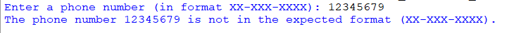
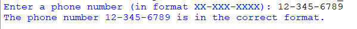

## Description
This program leverages regular expressions (regex) to verify whether a provided phone number adheres to the format XX-XXX-XXXX (two digits, a hyphen, three digits, a hyphen, four digits). Users can input a phone number to validate its format.
## Examples
♡ Example 1 :  

  

♡ Example 2 :  

